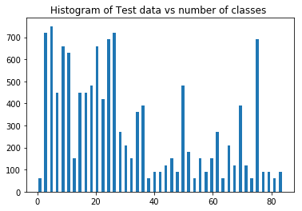
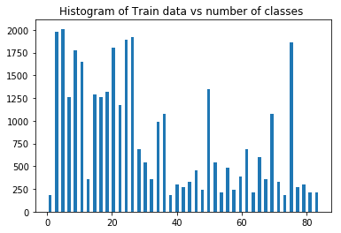
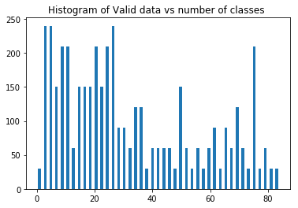

## Project: Build a Traffic Sign Recognition Classifier 
#### Aim 

1) ##### This project aim to display the skill set after completion of project Build a Traffic Sign Recognition Program as second project in the nano degree"
2) ##### neural network pipeline is made in order to get the expected output result's  
#### Overview
---
In this project, you will use what you've learned about deep neural networks and convolutional neural networks to classify traffic signs. You will train and validate a model so it can classify traffic sign images using the [German Traffic Sign Dataset](http://benchmark.ini.rub.de/?section=gtsrb&subsection=dataset). After the model is trained, you will then try out your model on images of German traffic signs that you find on the web.
#### The Project

---
The goals / steps of this project are the following:
* Load the data set
* Explore, summarize and visualize the data set
* Design, train and test a model architecture
* Use the model to make predictions on new images
* Analyze the softmax probabilities of the new images
* Summarize the results with a written report

### Dependencies
This lab requires:
* [CarND Term1 Starter Kit](https://github.com/udacity/CarND-Term1-Starter-Kit)
The lab environment can be created with CarND Term1 Starter Kit. Click [here](https://github.com/udacity/CarND-Term1-Starter-Kit/blob/master/README.md) for the details.

## Reflection
---
1) ### description of pipeline  
1) The code start from extracting traffice-sign-data set of three category 
1. traning
2. validation
3. test

2) Piepline consist of 5 set of step's 
* Reading image 
* checking the size of all the images
* plotting the graph on Labels vs Classes occurance in program
* Grayscale the image in order to obtain one color channel
* optiization via LeNet architecture
1) Lenet architecture take input of 32,32,1 input size image
2) Having 5 convolution Layer 
3) Having process to get (weight , bias , convolution or matmul ),using Activation funtion such as relu , and pooling , sometimes drop out is also used for best results
4) final output will be 84

* trainig pipe consist of LeNet architechture , softmax , training operation 
1 traingin operation use AdamOptimizer for backpropogation and lossoperation such as mean of data 
* evolution model is used 
* combining above pipes we train model , run validation set on it to know the accuraty usign evalutin pipe , run test data set and get 93.2 % prediction 
---
### Suggest possible improvements to your pipeline
* The Contrast of the image.
* The Angle of the traffic sign.
* Image might be jittered.
* noramlization can be applited 

